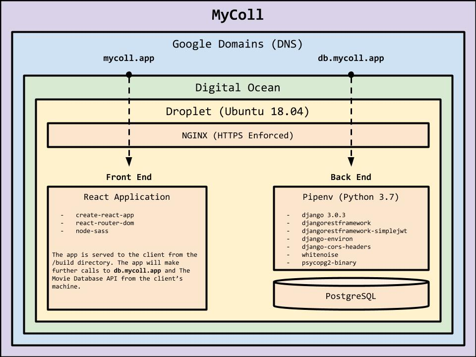

# MyColl Front End

## What is MyColl?

[MyColl](https://mycoll.app), pronounced 'Michael' but short for 'my collection', is a web app for cataloging your media collection. With MyColl you can search The Movie Database API to effortlessly add movies to your collection, then record any copies you may own along with its format and platform details. Now you'll know if your copy of Michael Chrichton's 1998 aquatic-horror thriller, Sphere, is a DVD sitting at home on your shelf, a VOD on a service like Amazon's Prime Video, or both! Currently the application supports movies but cataloging of shows and books will be integrated.

## Architecture

### Frameworks, Libraries, and Packages
- [**React**](https://reactjs.org/): JavaScript library for building user interfaces
- [**`create-react-app`**](): Package for quickly developing React applications
- [**`react-router-dom`**](): Package for navigating pages in React applications
- [**`node-sass`**](): Package for pre-processing `.scss` files into `.css`

### Full Stack Diagram

## Roadmap
- Styling Updates
- Show Cataloging
- Book Cataloging
- Collection Sorting
